# Guide de démonstration — interface web

Ce guide montre, en captures, comment exercer les principaux parcours de
l'interface : enrôler un notaire, enrôler des clients (mode démo **et** flux
endossé réel), créer un acte, y ajouter des parties, puis échanger des messages
chiffrés scellés par un journal Merkle.

> Pour lancer le serveur et le frontend, voir le **[README](../README.md)**
> (« Démarrage rapide »). Une fois le frontend ouvert sur `http://localhost:5173`,
> tout part de la page d'accueil.

### Astuce : une identité par onglet

Les clés vivent en `sessionStorage`, qui est **propre à chaque onglet**. Pour
jouer plusieurs personnes (notaire, Alice, Bob…), ouvre simplement
**un onglet par identité** — elles n'interfèrent pas. Le bouton **« Se
déconnecter »** abandonne l'identité de l'onglet courant pour repartir de zéro.

---

## La page d'accueil

Deux portes d'entrée (notaire / client) et un encart qui explique honnêtement les
simplifications du PoC.

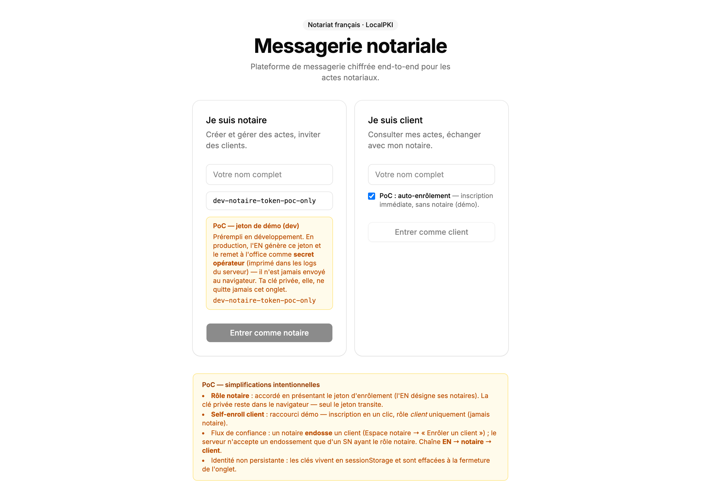

---

## 1. Enrôler un notaire

Carte **« Je suis notaire »** → saisis un nom. Un champ **« Jeton d'enrôlement
notaire »** est **prérempli en dev** (encart « PoC — jeton de démo ») : c'est
l'autorité de l'EN qui désigne ses notaires. → **« Entrer comme notaire »**.

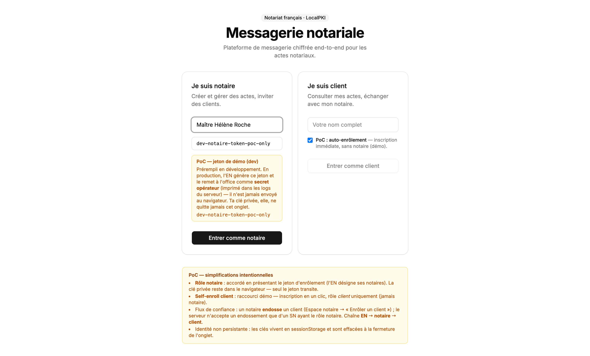

L'application déroule alors, **dans le navigateur**, les étapes
cryptographiques — génération de la paire Ed25519, construction du TBSCert
X.509v3, auto-signature `SI`, enrôlement auprès de l'EN, obtention du session
token. La clé privée ne transite jamais : seul le jeton est envoyé.

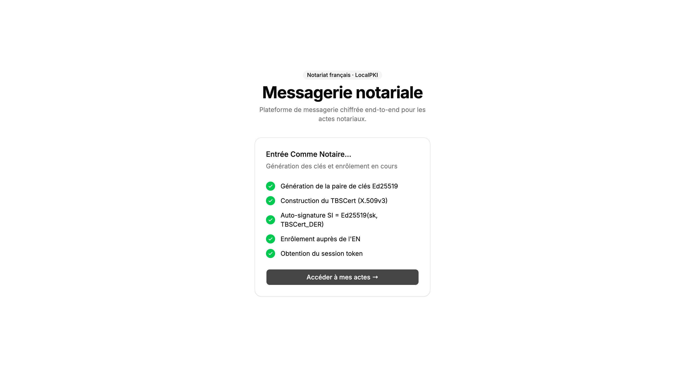

Tu arrives ensuite dans l'espace notaire (vide au départ) :

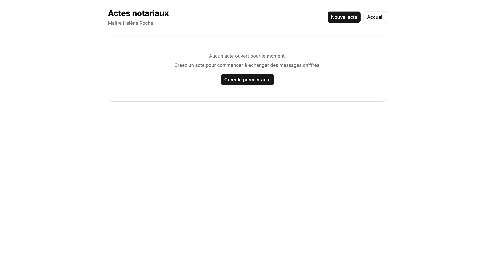

De retour sur l'accueil (logo / lien « Accueil »), ton identité est désormais
**connectée** : la page affiche ton nom, ton **SN** (cliquable pour le copier),
ton rôle `Notaire`, et donne accès à **« Mes actes »** comme à
**« Enrôler un client »** — c'est de là que part le flux d'endossement (§4).

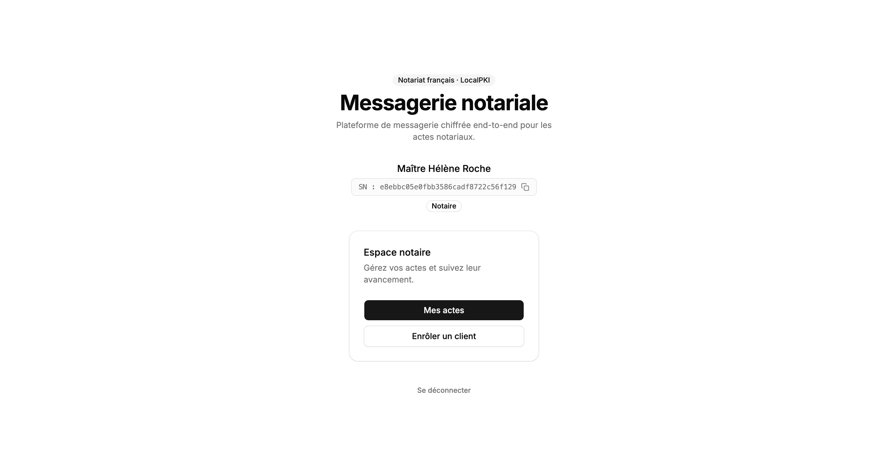

---

## 2. Enrôler un client (auto-signé — mode démo)

Dans **un nouvel onglet**, carte **« Je suis client »**. Le switch
**« PoC : auto-enrôlement »** est **activé** par défaut → saisis un nom →
**« Entrer comme client »**.

Le client est inscrit immédiatement (mêmes étapes crypto que le notaire). Sa
fiche affiche son **SN** (cliquable pour le copier) — garde-le, il servira à
l'ajouter à un acte.

---

## 3. Créer un acte

Côté **notaire** → **« Nouvel acte »** → saisis un titre, colle le **SN du
client** dans **« Ajouter une partie (SN hex) »** puis **« Ajouter »** (le
notaire est ajouté automatiquement) :

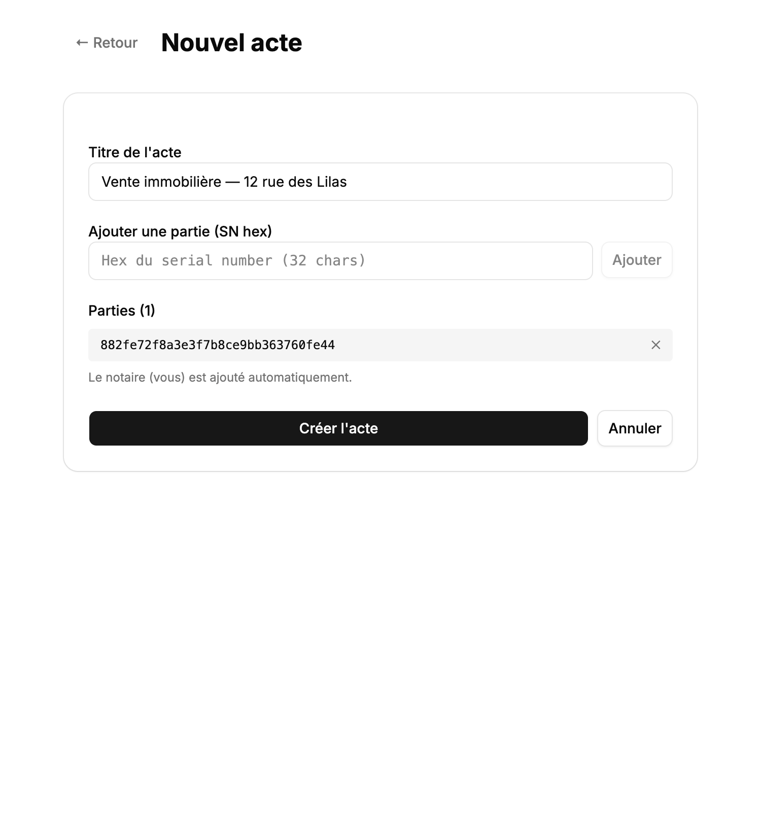

**« Créer l'acte »** déclenche l'opération HSM (dérivation de `K_acte`) côté
serveur et ouvre directement la messagerie chiffrée du dossier :

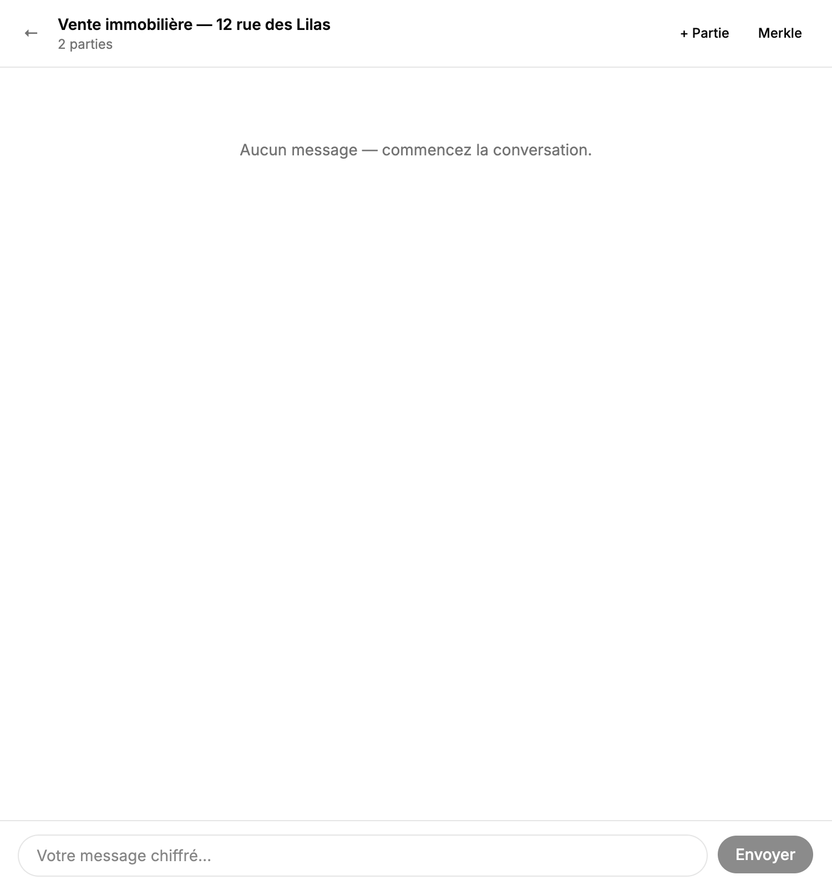

---

## 4. Enrôler un client **sans** auto-signé (flux endossé réel)

C'est le flux conforme à LocalPKI : le client génère son certificat, le notaire
l'endosse en tant que LRA.

**a.** Dans un nouvel onglet, carte **« Je suis client »**, **désactive** le
switch → le bouton devient **« Générer mon certificat »** :

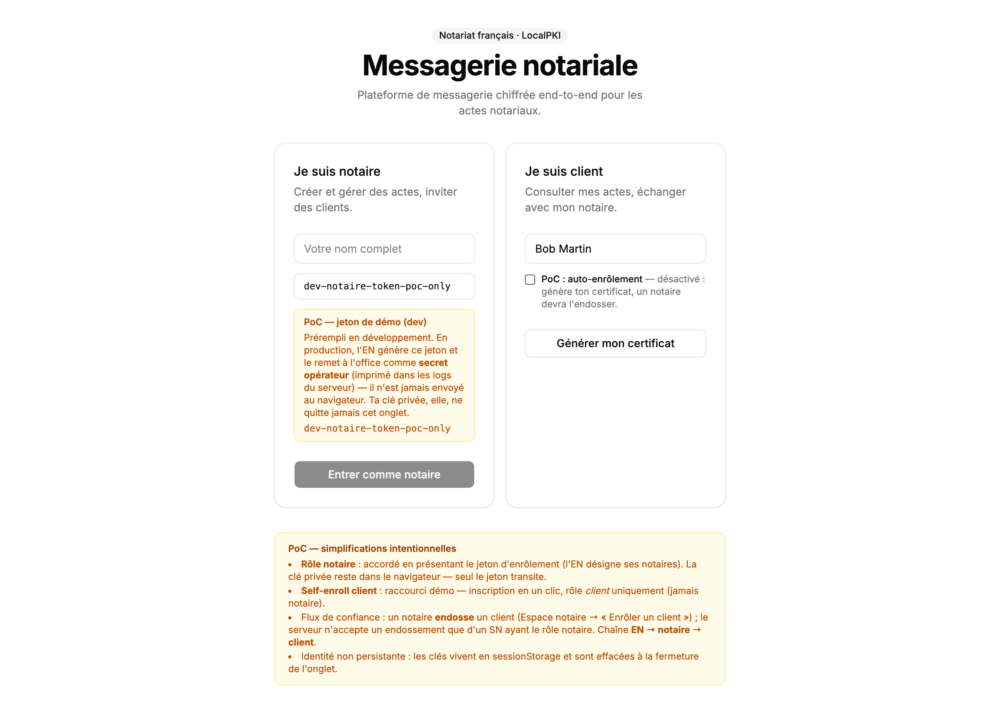

**b.** Le certificat est généré localement (pas encore enregistré). Le client le
**télécharge** (ou le copie) et le transmet à son notaire :

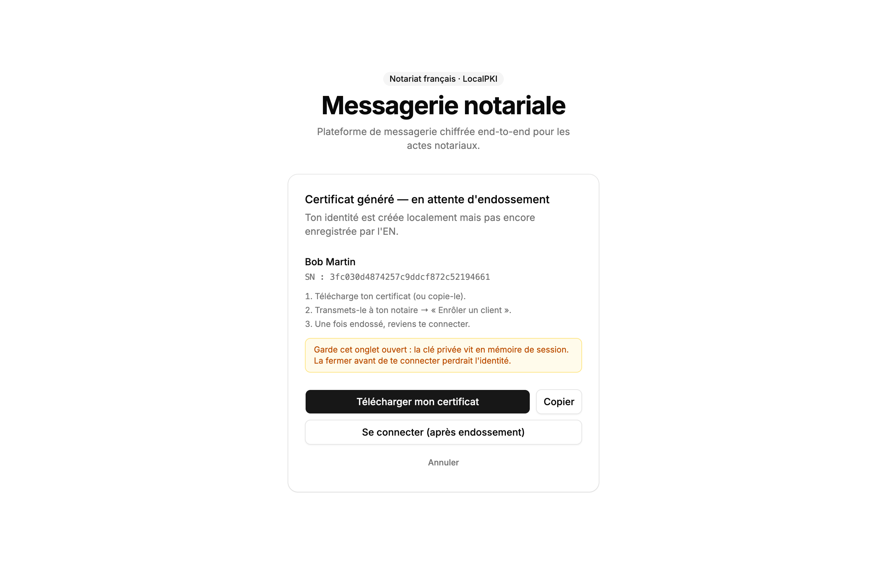

**c.** Côté **notaire** → accueil connecté → **« Enrôler un client »** → colle le
certificat reçu. L'aperçu confirme le sujet et le SN avant validation (le notaire
est censé vérifier l'identité physique **en personne** à cette étape) :

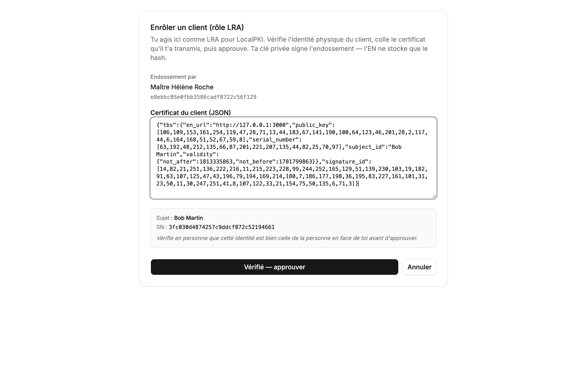

Après **« Vérifié — approuver »**, le notaire signe l'endossement avec sa clé
privée et l'identité est enregistrée auprès de l'EN (qui ne stocke que le hash) :

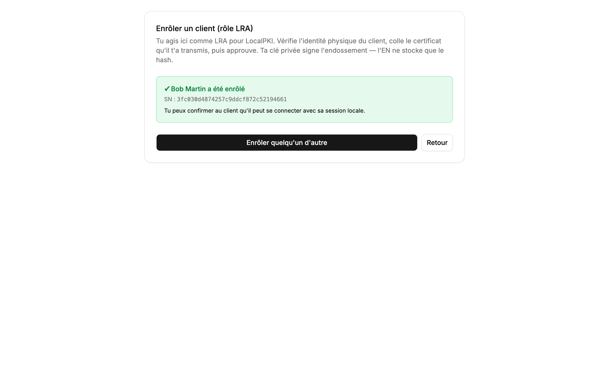

**d.** Le client revient sur **« Se connecter »** : il prouve la possession de sa
clé (signature d'un challenge) et obtient sa session :

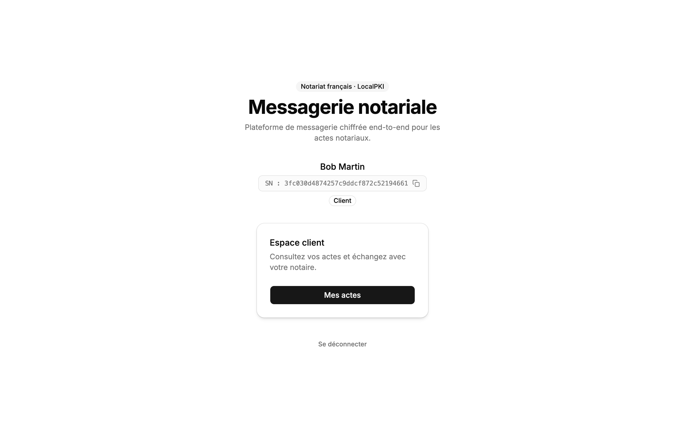

---

## 5. Ajouter une partie à un acte (avec historique)

Côté **notaire**, dans l'acte → **« + Partie »** → colle le SN du client →
**coche « Accès à l'historique des messages »** → **« Ajouter »**.

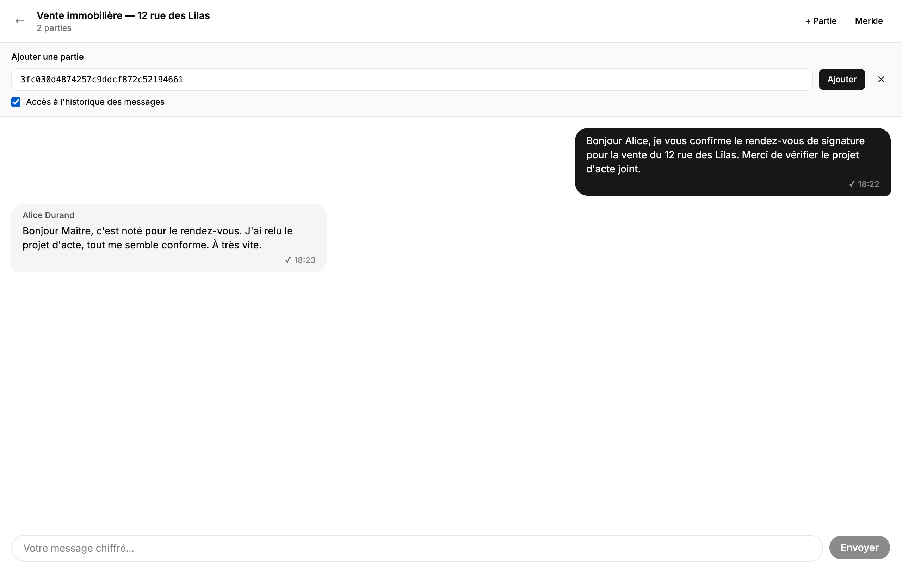

La partie pourra lire l'historique complet du dossier.

---

## 6. Ajouter une partie à un acte **sans** historique

Même panneau, mais **laisse « Accès à l'historique » décoché** :

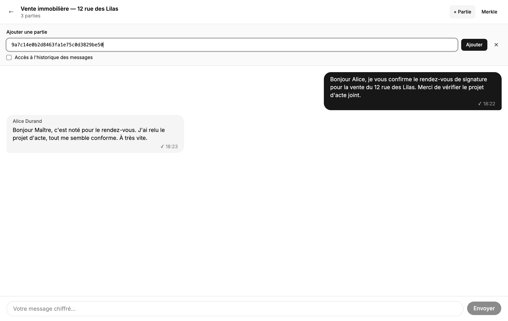

La partie ne verra que les messages **postérieurs** à son ajout.

> Remarque : « sans historique » est une restriction d'**interface**, pas une
> garantie cryptographique (le détenteur de `K_acte` pourrait techniquement
> déchiffrer l'historique). C'est documenté dans `ARCHITECTURE.md` §5.5 / §10.1.

---

## En action — messagerie chiffrée + journal Merkle

Côté client, le dossier apparaît dans **« Mes actes »** :

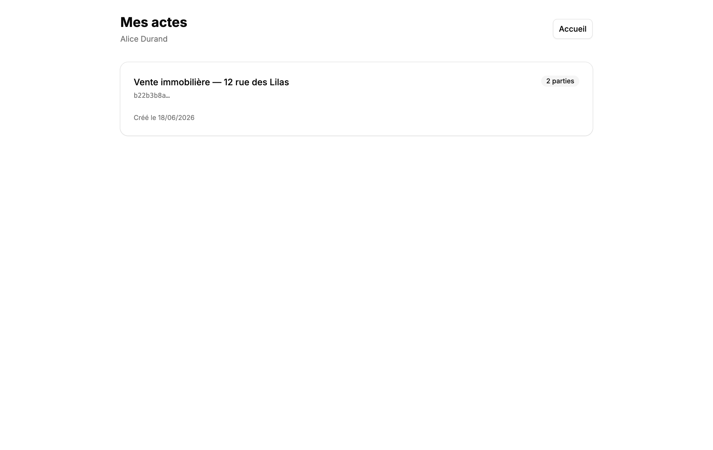

Les parties échangent ensuite des messages **chiffrés de bout en bout**. Chaque
message porte le nom de son expéditeur et un indicateur de **signature vérifiée**
(✓) — le serveur valide la signature Ed25519 sans jamais déchiffrer le contenu :

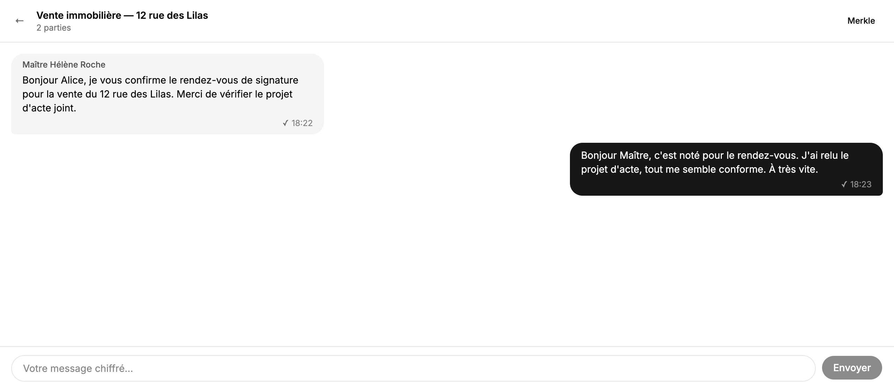

Le bouton **« Merkle »** déplie un bandeau qui affiche la **racine** du journal
de transparence, le nombre de messages **scellés**, et confirme que la racine est
**signée par l'EN** — ce qui ancre l'ordre total et l'intégrité de la
conversation :

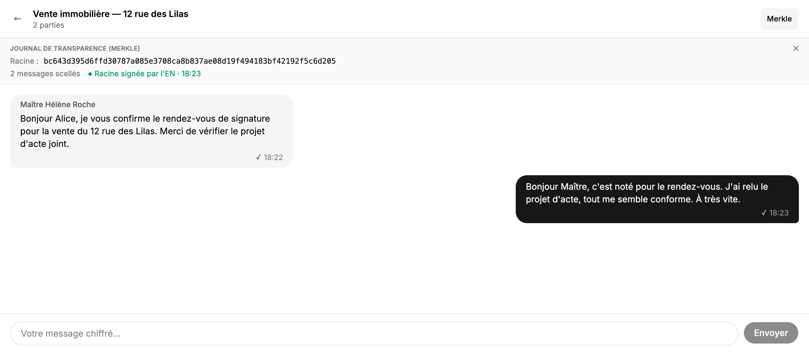

---

## Bon à savoir (limites assumées du PoC)

- **Modèle de confiance EN → notaire → client** : le rôle `notaire` s'obtient en
  présentant le **jeton d'enrôlement** (l'EN désigne ses notaires) — un client ne
  peut **jamais** se déclarer notaire. Le self-enrôlement client (switch activé)
  reste un raccourci démo (rôle `client`) ; le flux endossé (switch désactivé +
  « Enrôler un client ») est le parcours de confiance. Côté serveur, seul un
  `role=notaire` peut endosser un client ou créer un acte. Détails dans
  `ARCHITECTURE.md` §10.1.
- **Identité non persistante** : fermer l'onglet efface l'identité (clés en
  `sessionStorage`). Il n'y a pas de « se reconnecter plus tard comme Alice » —
  garde l'onglet ouvert le temps de la démo.
- **Une identité par onglet** : utilise des onglets séparés pour jouer plusieurs
  personnes en parallèle.

Toutes les limites sont documentées et justifiées dans `ARCHITECTURE.md` §10 et
`CRYPTO_REVIEW.md`.

---

## Idées de scénarios pour aller plus loin

Quelques parcours additionnels qui mettent en valeur des propriétés du système,
si tu veux étoffer une démo live :

- **Détection d'une forgerie** : modifie à la main un `c_message` ou une
  `signature` en base (ou via un appel `POST` falsifié) et montre que le serveur
  **rejette** le message — la signature porte sur le ciphertext, donc une
  altération est détectée sans déchiffrement.
- **Non-répudiation** : exhibe qu'un message signé par Alice ne peut pas être
  désavoué — sa `pk` est publique dans le registre LocalPKI, la vérification est
  reproductible par n'importe qui.
- **Cloisonnement « sans historique »** : ajoute Bob sans historique **après**
  quelques messages, et montre côté Bob qu'il ne voit que les messages
  postérieurs à son ajout.
- **Preuve d'inclusion Merkle** : après plusieurs messages, prends la racine
  signée par l'EN et vérifie qu'un message donné est bien scellé dedans
  (cohérent avec la commande `merkle inspect` du `demo-cli`).
- **Parcours 100 % CLI en parallèle** : lance
  `cargo run -p demo-cli -- scenario` pour rejouer enrollment → acte → messages →
  Merkle en ligne de commande, en miroir du parcours web.
</content>
